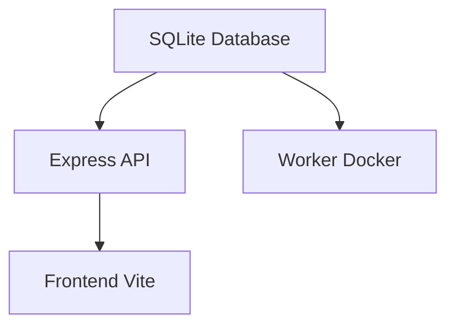

> Status: Active
> Owner: @jdubz
> Last Updated: 2025-11-25

# Development Environment Orchestration

## Overview

This document describes the development environment orchestration for the job-finder monorepo. All services run locally or via Docker, sharing a SQLite database.

## Architecture

### Service Dependencies



**Startup Order:**

1. **SQLite Database** - Initialized via migrations
2. **Express API** - Depends on database
3. **Frontend Vite** - Depends on API
4. **Worker Docker** - Depends on database

### Repository Structure

```
job-finder-bot/              # Monorepo root
├── job-finder-FE/           # Frontend (React + Vite)
├── job-finder-BE/           # Backend (Express API)
├── job-finder-worker/       # Worker (Python + Docker)
├── shared/                  # Shared TypeScript types
├── infra/                   # Infrastructure configs
│   ├── sqlite/              # Database migrations
│   └── docker-compose.yml   # Production deployment
└── data/
    └── sqlite/              # SQLite database files
```

## Standard Makefile Targets

All services implement consistent targets:

### Core Development Commands

| Target            | Description                 |
|-------------------|----------------------------|
| `make help`       | Show available commands    |
| `make install`    | Install dependencies       |
| `make dev`        | Start development server   |
| `make stop`       | Stop development server    |
| `make status`     | Check if service is running|
| `make test`       | Run tests                  |
| `make lint`       | Run linters                |
| `make migrate`    | Run database migrations    |

### Service-Specific Targets

**Frontend (job-finder-FE):**

```makefile
make dev          # Start Vite dev server
make build        # Build for production
make preview      # Preview production build
```

**Backend (job-finder-BE):**

```makefile
make dev          # Start Express server
make build        # Compile TypeScript
make test         # Run API tests
```

**Worker (job-finder-worker):**

```makefile
make docker-dev   # Start worker in Docker
make docker-shell # Enter Docker container
make docker-logs  # View Docker logs
make docker-stop  # Stop Docker container
```

## Root Orchestration Commands

Run from repository root:

### Full Stack Development

```bash
# Start complete development stack
make dev

# Stop all services
make stop

# Check service status
make status
```

### Individual Services

```bash
# Start only API
make dev-api

# Start only frontend
make dev-frontend

# Start only worker
make dev-worker
```

### Health & Status

```bash
# Check service status
make status

# Health check
curl http://localhost:8080/api/healthz
```

### Installation & Setup

```bash
# Install dependencies in all repos
make install

# Run database migrations
make migrate
```

## Environment Variables

### Required

| Variable            | Description                |
|--------------------|----------------------------|
| `GOOGLE_CLIENT_ID` | Google OAuth client ID     |
| `ANTHROPIC_API_KEY`| Claude API key             |
| `OPENAI_API_KEY`   | OpenAI API key             |

### Optional

| Variable           | Description              | Default          |
|-------------------|--------------------------|------------------|
| `PORT`            | API server port          | `8080`           |
| `SQLITE_PATH`     | Database file path       | `./data/sqlite/jobfinder.db` |
| `NODE_ENV`        | Node environment         | `development`    |
| `LOG_LEVEL`       | Logging verbosity        | `info`           |

## Port Allocation

| Service         | Port | Description            |
|-----------------|------|------------------------|
| Vite Dev Server | 5173 | Frontend development   |
| Express API     | 8080 | Backend API            |

## Workflow Examples

### Starting Development for the First Time

```bash
# 1. Install dependencies
make install

# 2. Run database migrations
make migrate

# 3. Start full development stack
make dev
```

### Daily Development

```bash
# Start dev stack
make dev

# Check health
curl http://localhost:8080/api/healthz

# When done
make stop
```

### Working on Frontend Only

```bash
# Terminal 1: Start API
make dev-api

# Terminal 2: Start frontend
cd job-finder-FE
make dev
```

### Working on API Only

```bash
# Start API with auto-reload
cd job-finder-BE
npm run dev
```

### Working on Worker Only

```bash
# Terminal 1: Ensure API is running for database
make dev-api

# Terminal 2: Start worker
make dev-worker
```

### Debugging

```bash
# Check what's running
make status

# View API logs
# (API logs to stdout when running in dev mode)

# View worker logs
docker logs job-finder-worker

# Check database
sqlite3 ./data/sqlite/jobfinder.db
```

## Troubleshooting

### Port conflicts

```bash
# Check which processes are using ports
lsof -i :5173
lsof -i :8080

# Kill processes on those ports
make stop
```

### Services not starting

```bash
# Check dependencies
make install

# Check database
make migrate

# View logs for errors
```

### Database issues

```bash
# Reset database
rm ./data/sqlite/jobfinder.db
make migrate
```
