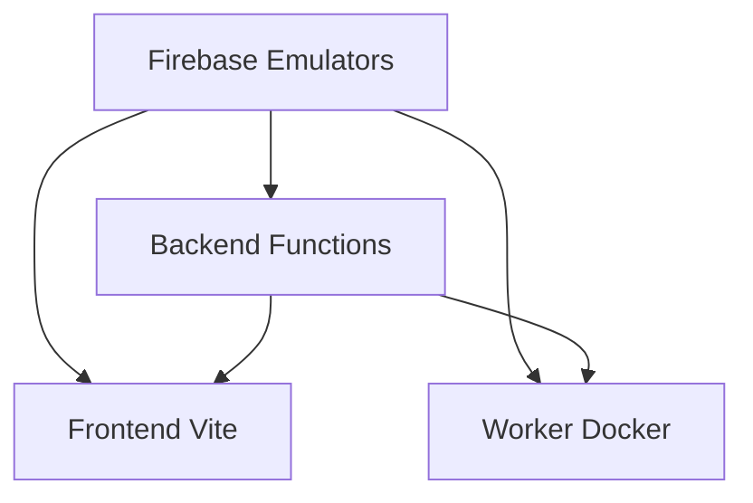

> Status: Active
> Owner: @jdubz
> Last Updated: 2025-11-25

# Development Environment Orchestration

## Overview

This document describes the unified development environment orchestration for all job-finder repositories, managed from the `job-finder-app-manager` repository.

## Architecture

### Service Dependencies



**Startup Order:**

1. **Firebase Emulators** (Firestore, Auth, Functions) - Port 8080, 9099, 5001
2. **Backend Functions** - Depends on emulators
3. **Frontend Vite** - Depends on emulators and Backend
4. **Worker Docker** - Depends on emulators

### Repository Structure

```
job-finder-app-manager/          # Orchestration root
├── job-finder-FE/              # Frontend (React + Vite)
├── job-finder-BE/              # Backend (Firebase Functions)
├── job-finder-worker/          # Worker (Python + Docker)
├── job-finder-shared-types/    # Shared TypeScript types
└── scripts/dev/                # Development orchestration scripts
```

## Standard Makefile Targets

All repositories implement these consistent targets:

### Core Development Commands

| Target            | Description                 | Example           |
| ----------------- | --------------------------- | ----------------- |
| `make help`       | Show available commands     | `make help`       |
| `make install`    | Install dependencies        | `make install`    |
| `make dev`        | Start development server    | `make dev`        |
| `make dev-build`  | Build before starting dev   | `make dev-build`  |
| `make dev-stop`   | Stop development server     | `make dev-stop`   |
| `make dev-status` | Check if service is running | `make dev-status` |
| `make dev-logs`   | Show development logs       | `make dev-logs`   |
| `make clean`      | Clean build artifacts       | `make clean`      |
| `make test`       | Run tests                   | `make test`       |
| `make lint`       | Run linters                 | `make lint`       |

### Repository-Specific Targets

**Frontend (job-finder-FE):**

```makefile
make emulators        # Start Firebase emulators
make emulators-stop   # Stop Firebase emulators
make emulators-status # Check emulator status
```

**Backend (job-finder-BE):**

```makefile
make functions        # Start Functions emulator
make functions-stop   # Stop Functions emulator
make functions-logs   # View Functions logs
```

**Worker (job-finder-worker):**

```makefile
make docker-dev       # Start worker in Docker
make docker-shell     # Enter Docker container
make docker-logs      # View Docker logs
make docker-stop      # Stop Docker container
```

## Manager Orchestration Commands

Run from `job-finder-app-manager` directory:

### Full Stack Development

```bash
# Start complete development stack (all services in tmux)
make dev-ui

# Attach to existing dev session
make dev-ui-attach

# Kill dev stack
make dev-ui-kill
```

### Individual Services

```bash
# Start only backend (emulators + functions)
make dev-backend

# Start only frontend (assumes emulators running)
make dev-frontend

# Start only worker (assumes emulators running)
make dev-worker
```

### Health & Status

```bash
# Comprehensive health check of all services
make dev-health-check

# Check service status
make dev-status

# View logs from all services
make dev-logs
```

### Installation & Setup

```bash
# Install dependencies in all repos
make dev-install

# Clean all repos
make dev-clean

# Validate environment (node, npm, docker, firebase-tools)
make dev-validate-env
```

### Port Management

```bash
# Check if required ports are available
make dev-check-ports

# Kill processes on required ports
make dev-kill-ports
```

## Development Scripts

Located in `job-finder-app-manager/scripts/dev/`:

### Environment Validation

**`check-env.sh`**

- Validates required tools: Node.js, npm, Docker, Firebase CLI
- Checks minimum versions
- Verifies environment variables
- Exit code 0 = success, 1 = failure

**`check-ports.sh`**

- Checks if required ports are available:
  - 5173 (Vite)
  - 8080 (Firestore Emulator)
  - 9099 (Auth Emulator)
  - 5001 (Functions Emulator)
  - 4000 (Emulator UI)
- Lists processes using ports if occupied
- Exit code 0 = all free, 1 = ports occupied

### Health Checks

**`wait-for-emulators.sh`**

- Waits for Firebase emulators to be ready
- Checks Firestore on localhost:8080
- Timeout: 60 seconds
- Exit code 0 = ready, 1 = timeout

**`wait-for-functions.sh`**

- Waits for Functions emulator to be ready
- Checks Functions on localhost:5001
- Timeout: 60 seconds
- Exit code 0 = ready, 1 = timeout

**`health-check.sh`**

- Comprehensive health check of all services
- Validates:
  - Firebase emulators running
  - Functions emulator responding
  - Vite dev server running
  - Worker Docker container running
- Colored output (green = healthy, red = error, yellow = warning)
- Exit code 0 = all healthy, 1 = issues found

### Service Management

**`start-services.sh`**

- Starts all services in dependency order
- Uses health checks instead of sleep timings
- Logs output to `logs/dev-{service}.log`
- Returns PID for each service

**`stop-services.sh`**

- Gracefully stops all services
- Kills processes by PID
- Cleans up log files

## tmux Layout

The `dev-ui` command creates a tmux session with 4 panes:

```
┌─────────────────┬─────────────────┐
│                 │                 │
│  Emulators      │  Backend        │
│  (FE)           │  (BE)           │
│                 │                 │
├─────────────────┼─────────────────┤
│                 │                 │
│  Frontend       │  Worker         │
│  (FE)           │  (Worker)       │
│                 │                 │
└─────────────────┴─────────────────┘
```

**Navigation:**

- `Ctrl+B` then arrow keys - Switch panes
- `Ctrl+B` then `z` - Zoom current pane
- `Ctrl+B` then `[` - Scroll mode (q to quit)
- Type `exit` in each pane to close

**Startup Sequence:**

1. **Pane 1** (top-left): Firebase emulators
2. **Pane 2** (top-right): Wait for emulators → Start Functions
3. **Pane 3** (bottom-left): Wait for emulators → Start Vite
4. **Pane 4** (bottom-right): Wait for emulators → Start Worker Docker

## Environment Variables

### Required

| Variable                         | Description              | Default            |
| -------------------------------- | ------------------------ | ------------------ |
| `GOOGLE_APPLICATION_CREDENTIALS` | Firebase service account | _(varies by repo)_ |
| `ANTHROPIC_API_KEY`              | Claude API key           | _(none)_           |

### Optional

| Variable                           | Description                | Default          |
| ---------------------------------- | -------------------------- | ---------------- |
| `FIRESTORE_EMULATOR_HOST`          | Firestore emulator address | `localhost:8080` |
| `FIREBASE_AUTH_EMULATOR_HOST`      | Auth emulator address      | `localhost:9099` |
| `FIREBASE_FUNCTIONS_EMULATOR_HOST` | Functions emulator address | `localhost:5001` |
| `VITE_USE_EMULATORS`               | Enable emulators in FE     | `true`           |
| `NODE_ENV`                         | Node environment           | `development`    |

## Port Allocation

| Service            | Port | Description                |
| ------------------ | ---- | -------------------------- |
| Vite Dev Server    | 5173 | Frontend development       |
| Vite Preview       | 4173 | Production preview         |
| Firestore Emulator | 8080 | Firebase Firestore         |
| Auth Emulator      | 9099 | Firebase Auth              |
| Functions Emulator | 5001 | Firebase Functions         |
| Emulator UI        | 4000 | Firebase Emulator Suite UI |
| Firebase Hosting   | 5000 | Firebase Hosting emulator  |

## Workflow Examples

### Starting Development for the First Time

```bash
# 1. Validate environment
make dev-validate-env

# 2. Install dependencies in all repos
make dev-install

# 3. Start full development stack
make dev-ui
```

### Daily Development

```bash
# Start dev stack
make dev-ui

# Or attach to existing session
make dev-ui-attach

# Check health
make dev-health-check

# When done
make dev-ui-kill
```

### Working on Frontend Only

```bash
# Terminal 1: Start backend services
make dev-backend

# Terminal 2: Start frontend
cd job-finder-FE
make dev
```

### Working on Backend Only

```bash
# Start emulators + functions
make dev-backend
```

### Working on Worker Only

```bash
# Terminal 1: Start emulators
cd job-finder-FE
make emulators

# Terminal 2: Start worker
cd job-finder-worker
make docker-dev
```

### Debugging Individual Services

```bash
# Check what's running
make dev-status

# View logs
make dev-logs

# Check ports
make dev-check-ports

# Health check
make dev-health-check

# Restart specific service
make dev-ui-kill
make dev-frontend  # or dev-backend, dev-worker
```

### Troubleshooting

**Port conflicts:**

```bash
# Check which processes are using required ports
make dev-check-ports

# Kill processes on those ports
make dev-kill-ports
```

**Services not starting:**

```bash
# Validate environment
make dev-validate-env

# Check health
make dev-health-check

# View logs
make dev-logs
```

**Emulators not connecting:**

```bash
# Check emulator status
cd job-finder-FE
make emulators-status

# Restart emulators
make emulators-stop
make emulators
```
