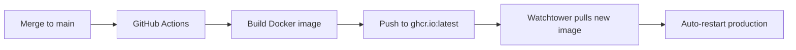
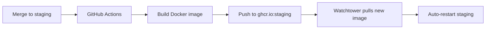

# Docker Compose Guide

This project uses **3 docker-compose files** for different deployment scenarios:

## File Overview

### 1. `docker-compose.production.yml` - Production (Portainer)

**Purpose**: Portainer stack deployment to production environment on NAS

**Key Features**:
- Uses `ghcr.io/jdubz/job-finder:latest` image
- Connects to production Firestore (`portfolio`)
- Absolute NAS volume paths for credentials, config, logs, data
- Higher resource limits (2 CPU, 2GB RAM)
- Watchtower auto-updates enabled (5 min interval)
- Cloud logging enabled

**Environment**:
```bash
ENVIRONMENT=production
PROFILE_DATABASE_NAME=portfolio
STORAGE_DATABASE_NAME=portfolio
```

**Usage** (in Portainer):
1. Create new stack named `job-finder-production`
2. Paste contents of `docker-compose.production.yml`
3. Set environment variables:
   - `ANTHROPIC_API_KEY`
   - `OPENAI_API_KEY` (optional)
4. Deploy stack

---

### 2. `docker-compose.staging.yml` - Staging (Portainer)

**Purpose**: Portainer stack deployment to staging environment on NAS

**Key Features**:
- Uses `ghcr.io/jdubz/job-finder:staging` image (separate from production)
- Connects to staging Firestore (`portfolio-staging`)
- Absolute NAS volume paths for credentials, config, logs, data
- Moderate resource limits (1 CPU, 1GB RAM)
- Watchtower auto-updates enabled (3 min interval - more aggressive)
- Cloud logging enabled
- CRON disabled (manual queue processing only)

**Environment**:
```bash
ENVIRONMENT=staging
PROFILE_DATABASE_NAME=portfolio-staging
STORAGE_DATABASE_NAME=portfolio-staging
ENABLE_CRON=false
```

**Usage** (in Portainer):
1. Create new stack named `job-finder-staging`
2. Paste contents of `docker-compose.staging.yml`
3. Set environment variables:
   - `ANTHROPIC_API_KEY`
   - `OPENAI_API_KEY` (optional)
4. Deploy stack

---

### 3. `docker-compose.dev.yml` - Local Development

**Purpose**: Local development with live code mounting and Firebase emulators

**Key Features**:
- Builds from `Dockerfile.dev` (includes dev tools)
- Mounts local source code for live editing (no rebuild needed)
- Connects to Firebase emulators on host machine
- Uses `host.docker.internal` for emulator connectivity
- Relative volume paths (works anywhere)
- No resource limits
- Interactive shell access

**Prerequisites**:
1. Start Firebase Emulators in `job-finder-BE`:
   ```bash
   cd ../job-finder-BE/functions
   npm run emulators:start
   ```
2. Emulators should be running at:
   - Firestore: `localhost:8080`
   - Auth: `localhost:9099`
   - Functions: `localhost:5001`

**Environment**:
```bash
ENVIRONMENT=development
FIRESTORE_EMULATOR_HOST=host.docker.internal:8080
FIREBASE_AUTH_EMULATOR_HOST=host.docker.internal:9099
CONFIG_PATH=/app/config/config.dev.yaml
```

**Usage**:
```bash
# Start development container
docker-compose -f docker-compose.dev.yml up

# Rebuild and start (after dependency changes)
docker-compose -f docker-compose.dev.yml up --build

# Enter shell for debugging
docker-compose -f docker-compose.dev.yml exec job-finder bash

# View logs
docker-compose -f docker-compose.dev.yml logs -f

# Stop and remove
docker-compose -f docker-compose.dev.yml down
```

**Development Workflow**:
1. Start Firebase emulators
2. Start dev container with `docker-compose -f docker-compose.dev.yml up`
3. Edit code in `src/`, changes are reflected immediately
4. Container stays running for debugging
5. Enter shell to run tests, check logs, etc.

---

## Deployment Workflows

### Production Deployment



**Manual deployment**:
1. Merge PR to `main` branch
2. GitHub Actions builds and pushes `ghcr.io/jdubz/job-finder:latest`
3. Watchtower detects new image (5 min interval)
4. Watchtower pulls and restarts production container

### Staging Deployment



**Manual deployment**:
1. Merge PR to `staging` branch
2. GitHub Actions builds and pushes `ghcr.io/jdubz/job-finder:staging`
3. Watchtower detects new image (3 min interval - faster than production)
4. Watchtower pulls and restarts staging container

---

## Environment Variables

### Required (All Environments)

| Variable | Description | Example |
|----------|-------------|---------|
| `ANTHROPIC_API_KEY` | Claude API key | `sk-ant-...` |
| `GOOGLE_APPLICATION_CREDENTIALS` | Firebase service account path | `/app/credentials/serviceAccountKey.json` |

### Optional (All Environments)

| Variable | Description | Default |
|----------|-------------|---------|
| `OPENAI_API_KEY` | OpenAI API key (if using GPT) | *(none)* |
| `CONFIG_PATH` | Config file path | `/app/config/config.yaml` |
| `LOG_FILE` | Log file path | `/app/logs/scheduler.log` |
| `TZ` | Timezone | `America/Los_Angeles` |

### Environment-Specific

| Variable | Production | Staging | Development |
|----------|------------|---------|-------------|
| `ENVIRONMENT` | `production` | `staging` | `development` |
| `PROFILE_DATABASE_NAME` | `portfolio` | `portfolio-staging` | `(default)` |
| `STORAGE_DATABASE_NAME` | `portfolio` | `portfolio-staging` | `(default)` |
| `ENABLE_QUEUE_MODE` | `true` | `true` | *(unset)* |
| `ENABLE_CRON` | `true` | `false` | *(unset)* |
| `ENABLE_CLOUD_LOGGING` | `true` | `true` | *(unset)* |
| `FIRESTORE_EMULATOR_HOST` | *(unset)* | *(unset)* | `host.docker.internal:8080` |

---

## Volume Mounts

### Production & Staging (Absolute NAS Paths)

Both use NAS storage at:
```
/srv/dev-disk-by-uuid-45e47416-96ad-41be-9fc0-582e15241cbd/storage/jobscraper/{environment}/
```

**Directory Structure**:
```
/storage/jobscraper/
├── production/
│   ├── credentials/          # Firebase service account JSON
│   ├── config/              # Production config YAML
│   ├── logs/                # Persistent logs
│   └── data/                # Job results, exports
└── staging/
    ├── credentials/
    ├── config/
    ├── logs/
    └── data/
```

### Development (Relative Paths)

Uses local project directories:
```
./credentials/    (read-only)  - Firebase credentials
./config/         (read-write) - Config files for editing
./logs/           (read-write) - Log output
./data/           (read-write) - Job results
./src/            (read-write) - Source code (live editing!)
./scripts/        (read-write) - Utility scripts
./tests/          (read-write) - Test files
```

---

## Resource Limits

| Environment | CPU Limit | Memory Limit | CPU Reserved | Memory Reserved |
|-------------|-----------|--------------|--------------|-----------------|
| Production  | 2.0       | 2G           | 0.5          | 512M            |
| Staging     | 1.0       | 1G           | 0.25         | 256M            |
| Development | None      | None         | None         | None            |

---

## Watchtower Auto-Updates

Both production and staging include Watchtower for automatic Docker image updates.

**Configuration**:
- **Production**: Checks every 5 minutes
- **Staging**: Checks every 3 minutes (more aggressive)
- **Label-based**: Only updates containers with `com.centurylinklabs.watchtower.enable=true`
- **Cleanup**: Removes old images after update
- **Restart**: Automatically restarts container with new image

**Disable auto-update**:
Remove or comment out the `watchtower` service in the compose file.

**Manual update**:
```bash
# In Portainer, update stack or restart services
# Or manually pull new image
docker pull ghcr.io/jdubz/job-finder:latest
docker-compose -f docker-compose.production.yml up -d
```

---

## Healthchecks

All environments include healthchecks:
```yaml
test: ["CMD", "python", "-c", "import sys; sys.exit(0)"]
interval: 5m
timeout: 10s
retries: 3
start_period: 30s
```

This ensures the Python runtime is working. Customize as needed for application-specific health checks.

---

## Troubleshooting

### Production/Staging Issues

**Container won't start:**
1. Check Portainer logs
2. Verify environment variables are set
3. Verify volume paths exist on NAS
4. Check Firestore credentials are valid

**Container restarts continuously:**
1. Check for errors in logs: `/storage/jobscraper/{env}/logs/`
2. Verify API keys are valid
3. Check resource limits aren't too restrictive

**Watchtower not updating:**
1. Verify GitHub Actions successfully built and pushed image
2. Check Watchtower logs: `docker logs watchtower-job-finder-{env}`
3. Manually trigger update: `docker pull ghcr.io/jdubz/job-finder:{tag}`

### Development Issues

**Cannot connect to emulators:**
1. Ensure emulators are running: `curl http://localhost:8080`
2. Check `host.docker.internal` resolves correctly
3. On Linux, may need `--add-host=host.docker.internal:host-gateway`

**Code changes not reflecting:**
1. Ensure volumes are mounted correctly
2. Check for Python caching: `rm -rf **/__pycache__`
3. Restart container: `docker-compose -f docker-compose.dev.yml restart`

**Permission errors:**
1. Mounted volumes may have wrong ownership
2. Fix: `sudo chown -R $USER:$USER ./logs ./data`

---

## Best Practices

### Production
- ✅ Always test in staging first
- ✅ Monitor logs after deployments
- ✅ Keep credentials secure (never commit to git)
- ✅ Review Watchtower update logs
- ✅ Set up external monitoring (uptime checks)

### Staging
- ✅ Use staging Firestore database
- ✅ Test with realistic data
- ✅ Verify cloud logging works
- ✅ Test full deployment pipeline
- ✅ Keep CRON disabled (manual testing)

### Development
- ✅ Use emulators, not real Firebase
- ✅ Keep dev dependencies in `Dockerfile.dev` only
- ✅ Test with `config.dev.yaml`
- ✅ Run tests before committing
- ✅ Don't commit sensitive data

---

## File Checklist

When making changes, ensure all 3 files stay in sync:

- [ ] Environment variables are documented
- [ ] Volume mounts are correct for each environment
- [ ] Resource limits are appropriate
- [ ] Healthchecks are enabled
- [ ] Watchtower is configured (prod/staging only)
- [ ] Documentation is updated

---

**Last Updated**: 2025-10-20
**Owner**: Worker A
**Status**: Production
